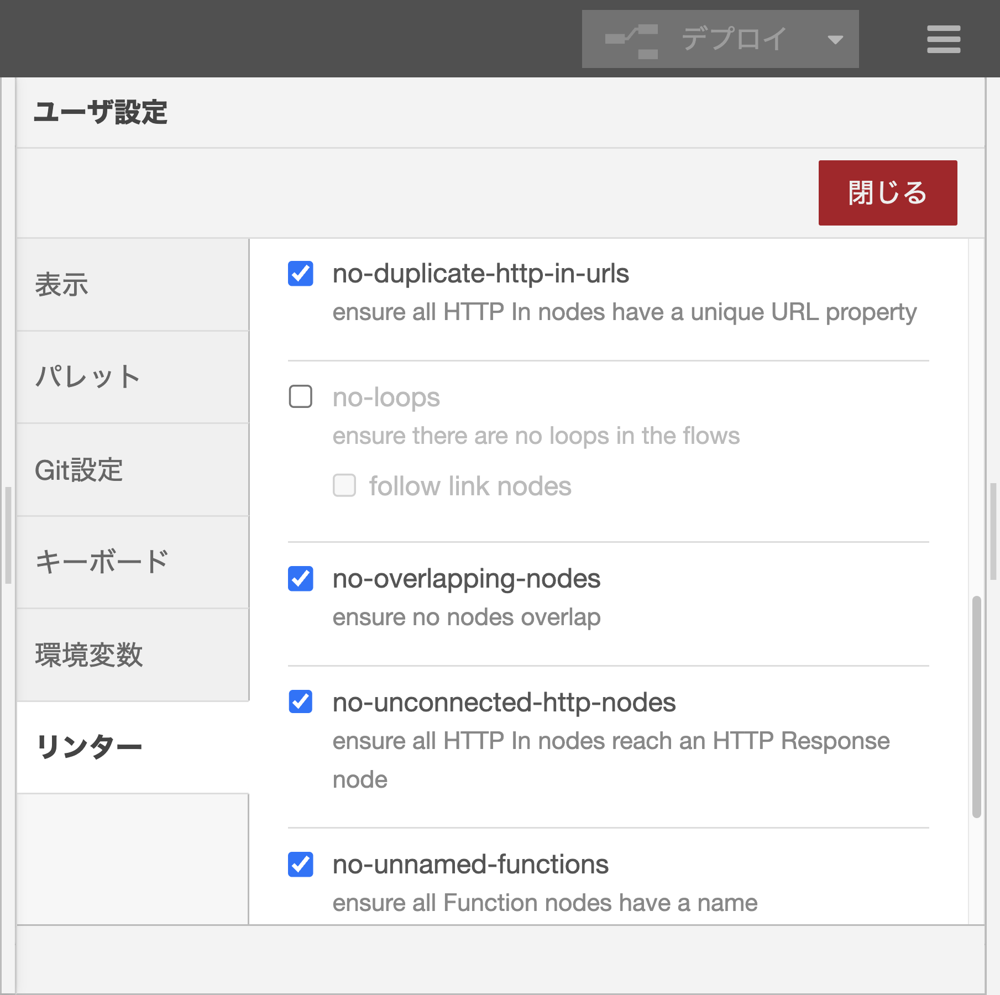

# フローの静的解析ツール「Flow linter」
2023年8月31日 横井一仁
https://kazuhitoyokoi.github.io/flow-linter/

---
# 自己紹介

---
# 最近のNode-RED関連のニュース
- GAIA-X
- NECさん
- Open Source Summit China


---
# Flow linterの紹介

---
# フロー開発でよくある問題
個人開発での😱から、大規模開発での🔥まで色々
- http-in、http responseがペアになっていない
- フローにループが存在
- functionノードのJavaScriptコードの記述が自由
- 日本語やドイツ語などのローカル言語を使ってしまう

-> これらの問題を避けて、フローをサクサク開発したい

---
# Flow linterとは
- 
- InfoQでも紹介
- インストール方法
```bash
$ cd ~/.node-red
$ npm install nrlint
```


https://www.infoq.com/jp/news/2021/08/node-red-2-0-improvements/

---
##### 標準で用意されているルール
| # | ルール                     | 説明 |
| - | ------------------------- | ---- |
| 1 | align-to-grid             | ノードの配置をグリッドに合わせる |
| 2 | max-flow-size             | ノードの上限数 |
| 3 | no-duplicate-http-in-urls | http-inに設定したURLの重複を警 |
| 4 | no-loops                  | フローのループを検出 |
| 5 | no-overlapping-nodes      | hoge |
| 6 | no-unconnected-http-nodes | hoge |
| 7 | no-unnamed-functions      | hoge |
| 8 | no-unnamed-links          | hoge |

---
# ユーザ設定の画面
- ルールの無効/有効は、ユーザ設定から設定可能
- 各ルールの詳細設定も可能
- カスタムプラグインの場合、本UIに表示も可能


---
# カスタムルール

---
# カスタムルールのコード
```
module.exports = {
    "english-node-name": {
        meta: {
            type: "suggestion",
            severity: "warn",
            docs: {
                description: "全てのノードの名前を英語のみにする"
            }
        },
        create: function (context, ruleConfig) {
            return {
                "node": function (node) {
                    if (!node.config.name.match(/^[ -~]*$/)) {
                        context.report({
                            location: [node.id],
                            message: "ノード名は英数字、または記号である必要があります"
                        })
                    }
                }
            }
        }
    }
};
```
---
##### functionノード向けルール
| # | ルール                     | 説明 |
| - | ------------------------- | ---- |
| 1 | align-to-grid             | ノードの配置をグリッドに合わせる |
| 2 | max-flow-size             | ノードの上限数 |
| 3 | no-duplicate-http-in-urls | http-inに設定したURLの重複を警 |
| 4 | no-loops                  | フローのループを検出 |
| 5 | no-overlapping-nodes      | hoge |
| 6 | no-unconnected-http-nodes | hoge |
| 7 | no-unnamed-functions      | hoge |
| 8 | no-unnamed-links          | hoge |

---
# CLI版Flow linter
- インストール方法
```bash
$ npm install -g nrlint
$ nrlint --init > .nrlintrc.js
$ nrlint ~/.node-red/flows.json
```

---
# カスタムルールも動作
```JavaScript
module.exports = {
    "plugins": [
        "nrlint-plugin-rules-english-node-name" // hoge
    ],
    "rules": {
        "align-to-grid": true,
        "max-flow-size": true,
        "no-duplicate-http-in-urls": true,
        "no-loops": "off",
        "no-overlapping-nodes": true,
        "no-unconnected-http-nodes": true,
        "no-unnamed-functions": true,
        "no-unnamed-links": true,
        "english-node-name": true // hoge
    }
}
```

---
# GitLab CIで実行

---
# 書籍紹介
GitLab CIでの活用例を紹介予定
