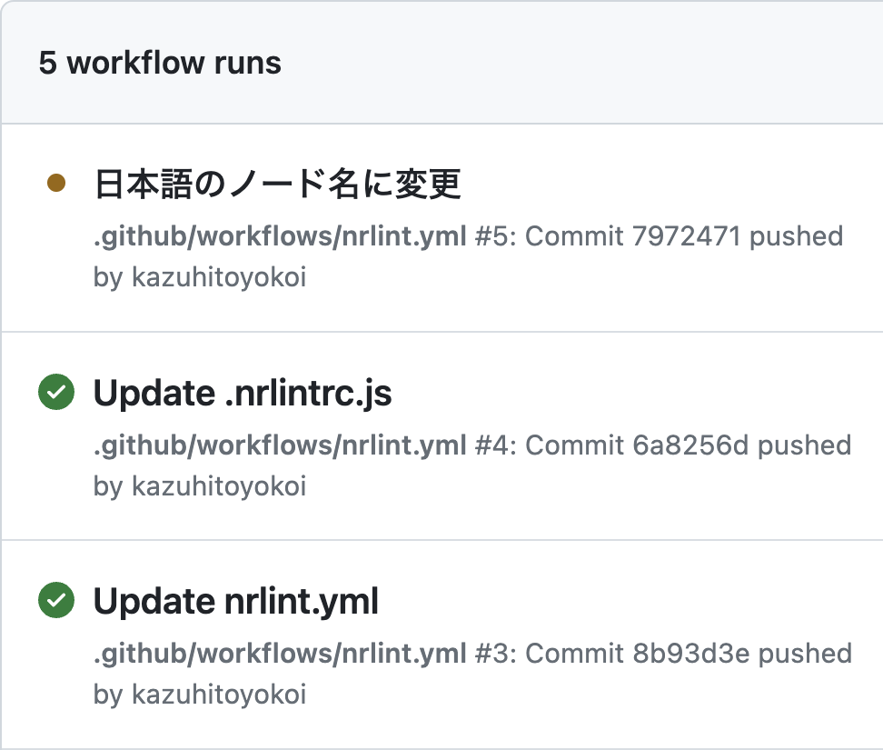
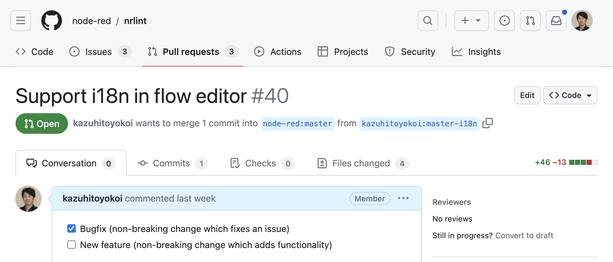

# フローの静的解析ツール「Flow Linter」
2023年8月31日 横井一仁
https://kazuhitoyokoi.github.io/flow-linter/

---
# 自己紹介
横井 一仁 (よこい かずひと)
- Node-RED開発メンバ
- Node-RED User Group運営
- 日立製作所
  - ソリューションアーキテクト
  - DX、Industry 4.0研修講師


---
# 最近のNode-RED関連のニュース (1/2)
- GAIA-X
  - 欧州の製造業のサプライチェーンをつなぐGAIA-XがNode-REDを採用
  - 2023年7月からEclipse Foundationの管理下でOSS開発を推進
- NECさん
  会社ブログでNode-RED v3.1への貢献、イベント登壇について紹介


https://jpn.nec.com/oss/community/blog/node-red_v3.1.html

---
# 最近のNode-RED関連のニュース (2/2)
- Node-RED Con 2023
  11月10日に、NTTコミュニーケーションズ本社ビルで年次カンファレンスを開催
- OpenJS World China 2023
  - 9月26日に上海でOpenJS Foundation主催のイベントを開催
  - Node-REDプロジェクトも登壇


---
# Flow Linterの紹介

---
# フロー開発で生じる問題
個人開発での😱から、大規模開発での🔥まで色々
- http-in、http responseがペアになっていない
- フローにループが存在
- ノード名にローカル言語を使ってしまう
- functionノードのJavaScriptコードの記述が自由

-> これらの問題を避けて、フローをサクサク開発したい

---
# Flow Linterとは
バグを生じる可能性があるフローの作成方法に対して警告を表示するツール
- フローエディタ上でリアルタイムに解析し、警告を表示
- functionノードのJavaScriptコードの解析にはESLintを採用


https://www.infoq.com/jp/news/2021/08/node-red-2-0-improvements/

---
# インストール方法
```bash
$ cd ~/.node-red
$ npm install nrlint
```

- フローエディタを開くと、右側にリントタブが追加される
- フローの静的解析も有効となり、
  警告時はノードの右上に「！」マークが表示される

---
##### 標準で用意されているルール
| # | ルール                     | 説明 |
| - | ------------------------- | ---- |
| 1 | align-to-grid             | ノードの配置をグリッドに合わせる |
| 2 | max-flow-size             | ノードの上限数 |
| 3 | no-duplicate-http-in-urls | http-inに設定したURLの重複を警告 |
| 4 | no-loops                  | フローのループを検出 |
| 5 | no-overlapping-nodes      | ノードが重なりを検出 |
| 6 | no-unconnected-http-nodes | http-in、http responseがペアになっているか |
| 7 | no-unnamed-functions      | functionノードに名前が付けられているか |
| 8 | no-unnamed-links          | linkノードに名前が付けられているか |

---
# ユーザ設定の画面
- ルールの無効/有効は、ユーザ設定から設定可能
- 各ルールの詳細設定も可能
- カスタムルールの場合、ユーザ設定UIに独自UIを表示可


---
# 本格的な使い方

---
##### functionノード向けルール
- hoge
- hoge

# カスタムルールを作成
標準ルール以外のルールを用いたい場合のカスタムルールにも対応
- プラグイン化してnpmに公開することも可能
- CLI版Flow linterでも利用可能

URL

---
# カスタムルールのコード
判定条件とメッセージを記載するだけでカスタムルールを実装できる
```JavaScript
module.exports = {
    "english-node-name": {
        meta: {
            type: "suggestion",
            severity: "warn",
            docs: {
                description: "全てのノードの名前を英語のみにする" // ユーザ設定に表示するメッセージ
            }
        },
        create: function (context, ruleConfig) {
            return {
                "node": function (node) {
                    if (!node.config.name.match(/^[ -~]*$/)) { // 判定条件
                        context.report({
                            location: [node.id],
                            message: "ノード名は英数字、または記号である必要があります" // 警告メッセージ
                        })
                    }
                }
            }
        }
    }
};
```

---
# コマンドライン版Flow Linter
フローの静的解析をコマンドラインで行う

- インストールと実行
```bash
$ npm install -g nrlint
$ nrlint --init > .nrlintrc.js
$ nrlint ~/.node-red/flows.json
```

実行結果の画像

---
# 設定ファイル「.nrlintrc.js」の内容
ルールを有効にしたい際は「true」、無効にしたい際は「"off"」を指定
```JavaScript
module.exports = {
    "rules": {
        "align-to-grid": true,
        "max-flow-size": true,
        "no-duplicate-http-in-urls": true,
        "no-loops": "off", // 無効
        "no-overlapping-nodes": true,
        "no-unconnected-http-nodes": true,
        "no-unnamed-functions": true,
        "no-unnamed-links": true,
    }
}
```

---
# カスタムルールも動作
```JavaScript
module.exports = {
    "plugins": [
        "nrlint-plugin-rules-english-node-name" // hoge
    ],
    "rules": {
        "align-to-grid": true,
        "max-flow-size": true,
        "no-duplicate-http-in-urls": true,
        "no-loops": "off",
        "no-overlapping-nodes": true,
        "no-unconnected-http-nodes": true,
        "no-unnamed-functions": true,
        "no-unnamed-links": true,
        "english-node-name": true // hoge
    }
}
```

---
# GitHub Actionsで自動テスト
- GitHubにフローを置くタイミングで、自動的にFlow Linterを実行
- 開発プロジェクトにて、フローの開発方法を事前定義



---
# 日本語化のPull Requestを出してみました🇯🇵

https://github.com/node-red/nrlint/pull/40

---
# 書籍紹介
GitLab CIでの活用例を紹介予定
